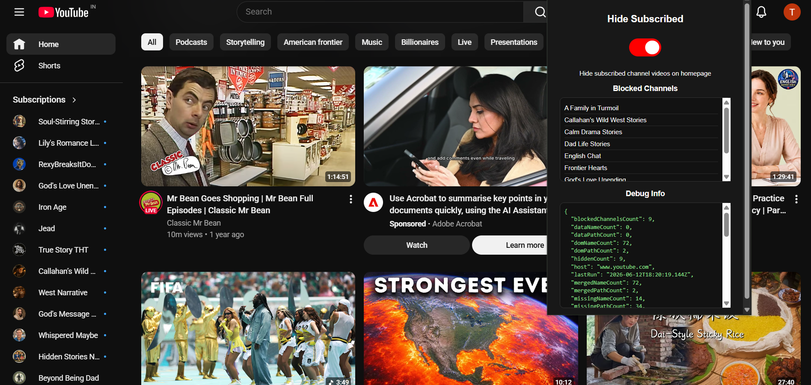

# Hide Subscribed Channels

A Chrome extension that hides videos from channels you are already subscribed to — **only on the YouTube homepage**. Your Subscriptions feed stays untouched.

## Features

- **Homepage only** — filters the main feed at `youtube.com/`; does not affect `/feed/subscriptions` or other pages
- **Off by default** — enable the toggle when you want a discovery-focused homepage
- **Auto-refresh** — turning the extension on or off reloads the active YouTube tab
- **Blocked channels list** — the popup shows which channels were hidden on the current session
- **Full subscription detection** — automatically expands the sidebar “Show more” button to load your complete subscription list
- **Works on desktop and mobile YouTube** — supports `www.youtube.com` and `m.youtube.com`

## Installation

1. Clone or download this repository
2. Open `chrome://extensions` in Chrome (or `edge://extensions` in Edge)
3. Enable **Developer mode**
4. Click **Load unpacked** and select this folder
5. Open [YouTube Home](https://www.youtube.com/) and click the extension icon to turn it on

## Usage

1. Go to the YouTube homepage
2. Click the extension icon in the toolbar
3. Toggle **Hide Subscribed** on — the page refreshes and subscribed-channel videos are hidden from the feed
4. View the **Blocked Channels** list in the popup to see what was filtered
5. Toggle off to restore the normal homepage

## How it works

The extension reads your subscribed channels from YouTube’s sidebar guide (including hidden entries behind “Show more”), then hides matching video cards on the homepage by channel name and URL. Blocked channel names are stored locally and shown in the popup.

## Files

| File | Purpose |
|------|---------|
| `manifest.json` | Extension configuration |
| `content.js` | Homepage filtering logic |
| `popup.html` / `popup.js` / `style.css` | Extension popup UI |
| `preview.png` | Screenshot for documentation |

## Permissions

- **storage** — save toggle state and blocked channel list
- **tabs** — reload the active YouTube tab when the toggle changes
- **host_permissions** (`https://*.youtube.com/*`) — run on YouTube pages

## License

MIT
